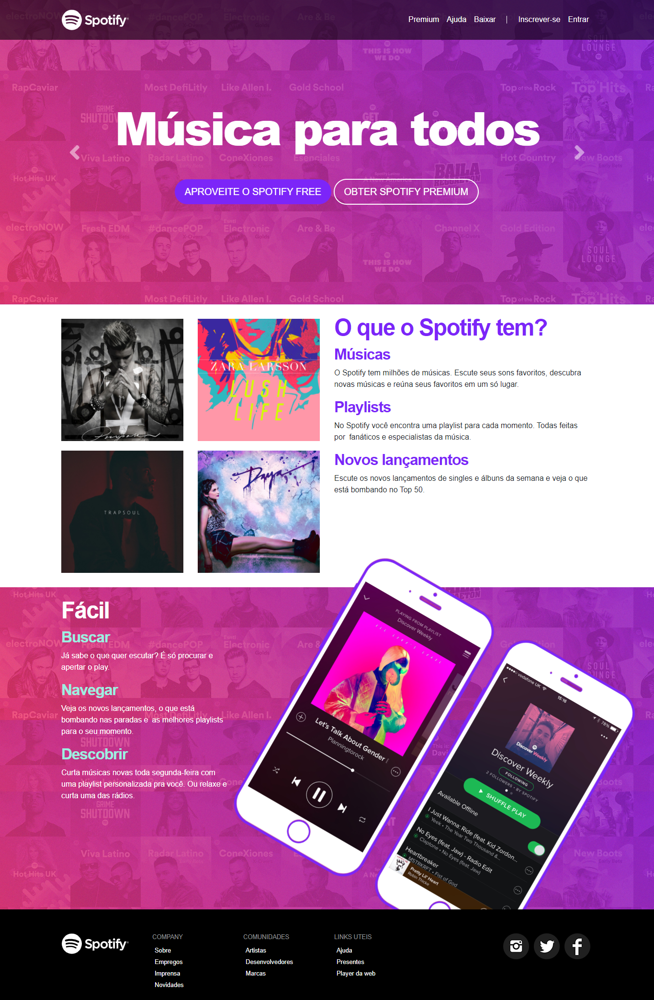

# Spotify Clone 🎵

Este projeto consiste na criação de uma interface semelhante ao Spotify, utilizando Bootstrap para tornar o projeto 100% responsivo, podendo ser visualizado perfeitamente em dispositivos móveis ou desktop.

## Tecnologias Utilizadas 🚀

  
  
  

## Resultado Final 📸

Abaixo um print do resultado final do projeto:

## Acesso ao Projeto 🌐

O projeto também está disponível no GitHub Pages e pode ser acessado por aqui: [Spotify Clone](https://rodrigomelo220.github.io/Spotify_Interface/).

## Licença 📄

Este projeto está licenciado sob a licença MIT. Veja o arquivo [LICENSE](LICENSE) para mais detalhes.

---

Feito com ❤️ por Rodrigo Melo